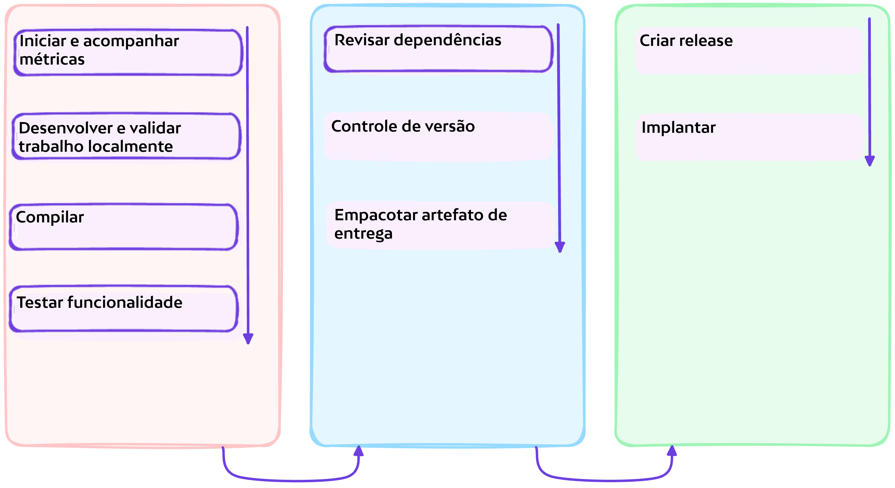

# :test_tube: Revisão de Dependências

<!-- markdownlint-disable MD033 MD046 -->

!!! quote ":octicons-milestone-16: Adicionar Verificações de Segurança"

    > A revisão de dependências ajuda você a entender as mudanças nas dependências e o impacto de segurança dessas mudanças em cada pull request. Ela fornece uma visualização facilmente compreensível das alterações de dependências com um diff detalhado na guia "Arquivos Alterados" de um pull request. A revisão de dependências informa você sobre:

    > - Quais dependências foram adicionadas, removidas ou atualizadas, juntamente com as datas de lançamento.
    > - Quantos projetos usam esses componentes.
    > - Dados de vulnerabilidade para essas dependências.

    

---

## Exercício: Automatizar a Aplicação da Revisão de Dependências

---

### **:material-numeric-1-circle: Entender as Configurações da Revisão de Dependências**

```yaml title=".github/dependency-review-config.yml"
fail-on-severity: moderate #(1)!

comment-summary-in-pr: always #(2)!

allow-licenses: #(3)!
  - MIT
  - GPL-3.0
  - BSD-3-Clause

deny-licenses: #(4)!
  - LGPL-2.0
  - BSD-2-Clause

allow-ghsas: #(5)!
  - GHSA-abcd-1234-5679
  - GHSA-efgh-1234-5679

fail-on-scopes: #(6)!
  - development
  - runtime
  - unknown
```

1. Valores possíveis: "critical", "high", "moderate", "low"
2. Publicar resumo como um comentário no respectivo pull request
3. Permitir apenas as licenças listadas (opcional). Valores possíveis: Quaisquer valores `spdx_id` de https://docs.github.com/pt/rest/licenses
4. Bloquear o pull request nestas licenças (opcional). Valores possíveis: Quaisquer valores `spdx_id` de https://docs.github.com/pt/rest/licenses

    :warning: Você só pode incluir uma dessas duas opções: `allow-licenses` e `deny-licenses`.

5. Ignorar esses IDs do Banco de Dados de Avisos do GitHub durante a detecção (opcional). Valores possíveis: Qualquer ID válido do Banco de Dados de Avisos do GitHub de https://github.com/advisories
6. Bloquear pull requests que introduzem vulnerabilidades nos escopos que correspondem a esta lista (opcional). Valores possíveis: "development", "runtime", "unknown"

---

### **:material-numeric-2-circle: Implementar Verificação de Revisão de Dependências**

Abra o arquivo `.github/workflows/continuous.integration.yml` no editor e adicione o conteúdo {== destacado ==} da seguinte forma:

```yaml title=".github/workflows/continuous.integration.yml" linenums="1" hl_lines="58-67"
--8<-- "reference.implementations/workflows/1.2.continuous.integration.yml"
```

---

### **:material-numeric-2-circle: Fazer commit e publicar suas alterações**

Enviar suas alterações aplicará a verificação no pull request existente.

!!! tip "Você pode vincular suas alterações a uma issue"

    Lembre-se da issue que você criou anteriormente e seu respectivo número, você o usará para vincular suas alterações atuais à issue.

```bash linenums="1"
git add .
git commit -m "$(printf 'Criar um jogo de tetris para impulsionar o engajamento do site\n\n-Adicionar revisão de dependências como verificação de segurança\n\n- Resolve #<NÚMERO-DA-ISSUE>')"
git push origin feature/tetris-game
```

{==

Quando você navegar até o repositório no GitHub e abrir o pull request existente, poderá confirmar que a verificação foi executada. Como não há violações de conformidade atualmente no PR, a verificação é bem-sucedida.


==}

!!! question "Tarefa para casa"

    Você consegue tentar fazer com que a verificação de revisão de dependências falhe?

---

## 📚 Recursos

- [Entendendo sua cadeia de suprimentos de software](https://docs.github.com/pt/code-security/supply-chain-security/understanding-your-software-supply-chain)
- [GitHub Advanced Security - Gráfico de Dependências](https://docs.github.com/pt/code-security/supply-chain-security/understanding-your-software-supply-chain/about-the-dependency-graph)
